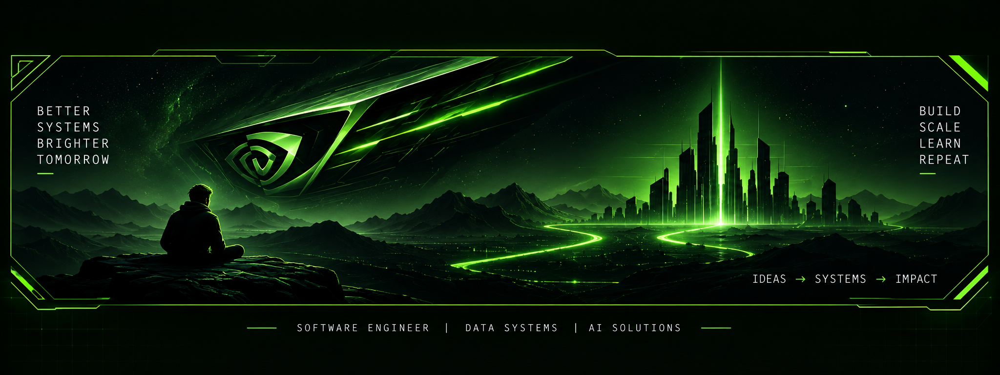

<!-- DARK FUTURISTIC GREEN DEVELOPER PROFILE -->

<!-- No NVIDIA branding — only a dark neon-green visual theme. -->

  

  <b>Software Engineer | 5+ Years Experience</b> 
  <b>RAG Data Platforms | Semantic Search Optimization</b> 
  <b>LLM Indexing &amp; Retrieval Pipelines</b> 
  <b>Fine-Tuning (PEFT, LoRA, QLoRA)</b> 
  <b>Kafka Processing 2M+ Events/Day</b>

  
  
  

💡 <i>Use dark mode for the intended experience.</i>

<table width="100%" bgcolor="#050805" border="1" bordercolor="#285A1A">
<tr>
<td valign="top">

<h3>🔴 🟡 🟢 &nbsp; &gt; whoami</h3>

aman@dev-box ~ % whoami --verbose

OS:              Backend & Data Engineer
Shell:           Python (Django, FastAPI) · Java (Spring Boot)
Experience:      5+ years

Specialization:  RAG Data Platforms
                 Semantic Search Optimization
                 LLM Indexing & Retrieval

Fine-Tuning:     PEFT · LoRA · QLoRA
Throughput:      Kafka pipelines, 2M+ events/day
Scale:           Backend platforms serving 10K+ users

Optimizations:   API latency -35%
                 Search query time -83%

Currently:       Exploring deep neural nets & LLM internals
LeetCode:        300+ problems solved

</td>
<td width="42%" valign="top">
<h3>⚡ &gt; Philosophy</h3>

<blockquote><i>Complex systems don't fail because they are complicated — they fail because they aren't understood.</i></blockquote>

The most interesting engineering problems appear when systems begin to scale.

That's the space I enjoy working in.

THINK
BUILD
SCALE
REPEAT

</td>
</tr>
</table>

 

<table width="100%" bgcolor="#050805" border="1" bordercolor="#285A1A">
<tr><td>
<h2>♙ &nbsp; &gt; About Me</h2>

Backend & Data Engineer with <b>5+ years of experience</b> building scalable systems, high-performance data platforms, and — more recently — <b>LLM-powered retrieval infrastructure</b>.

I turn distributed systems, event pipelines, and backend architectures into platforms that stay fast, stable, and resilient in production.

</td></tr>
<tr><td>
<table width="100%" bgcolor="#071007" border="1" bordercolor="#214A19">
<tr>
<td width="33%" valign="top"><h3>🚀 Mission</h3>
Scalable design patterns, done right.  
I build with Python, Java, SQL &amp; NoSQL systems, cloud platforms, and modern UI frameworks — with data management and distributed-systems architecture at the core.
</td>
<td width="33%" valign="top"><h3>📊 Delivering Impact</h3>
• Event-driven pipelines processing <b>2M+ events/day</b> 
• Backend platforms serving <b>10K+ users</b> 
• API latency reduced by <b>35%+</b> 
• Search query times cut by <b>83%</b>
</td>
<td width="33%" valign="top"><h3>🧠 AI / LLM Systems Work</h3>
• RAG data platforms &amp; retrieval pipelines 
• Semantic search optimization 
• LLM indexing &amp; retrieval architecture 
• Fine-tuning: PEFT, LoRA, QLoRA 
• Data-intelligence layers feeding model workflows
<h3>📚 Exploration &amp; Learnings</h3>
• 300+ LeetCode problems 
• Deep-diving neural networks 
• Exploring LLM internals
</td>
</tr>
</table>
</td></tr>
<tr><td><b>🎯 Looking ahead:</b> distributed systems, cloud-native architecture, and the evolving stack connecting data platforms to intelligent, retrieval-augmented applications.</td></tr>
</table>

 

<table width="100%" bgcolor="#050805" border="1" bordercolor="#285A1A"><tr><td>
<h2>⚙️ &nbsp; &gt; Tech Stack</h2>
<table width="100%" bgcolor="#071007" border="1" bordercolor="#214A19">
<tr>
<td width="33%" valign="top"><h3>🌐 Frontend</h3>

HTML5 · CSS3 · Angular · React · TypeScript · JavaScript</td>
<td width="33%" valign="top"><h3>⚙️ Backend &amp; Frameworks</h3>

Python · Django · FastAPI · Java · Spring Boot</td>
<td width="33%" valign="top"><h3>🧠 AI / LLM &amp; Data</h3>

RAG · Semantic Search · Embeddings · Retrieval · PEFT · LoRA · QLoRA · Kafka</td>
</tr>
<tr>
<td valign="top"><h3>🗄️ Databases</h3>

MongoDB · PostgreSQL · MySQL · SQL Server · Redis · Elasticsearch</td>
<td valign="top"><h3>☁️ Cloud</h3>

AWS · Azure · Google Cloud · Databricks · Lakehouse</td>
<td valign="top"><h3>🧰 Tools &amp; Utilities</h3>

VS Code · Postman · Docker · Git · Linux · REST · CI/CD</td>
</tr>
</table>
</td></tr></table>

 

<table width="100%" bgcolor="#050805" border="1" bordercolor="#285A1A"><tr><td>
<h2>📊 &nbsp; &gt; GitHub Stats</h2>

</td></tr></table>

 

<table width="100%" bgcolor="#050805" border="1" bordercolor="#285A1A"><tr><td>
<table width="100%"><tr>
<td align="center"><b>⚙️ BACKEND</b> Distributed Systems Microservices System Design</td>
<td align="center"><b>📡 DATA</b> Kafka Data Pipelines Lakehouse</td>
<td align="center"><b>🧠 AI</b> RAG LLM Retrieval Fine-Tuning</td>
<td align="center"><b>🔍 SEARCH</b> Semantic Search Embeddings Indexing</td>
</tr></table>
</td></tr></table>

 

<b>🔴 🟡 🟢 &nbsp; aman@dev-box — zsh</b>

aman@dev-box ~ % echo "while (age++ < life.length): ++knowledge; ++experience; --ego; debug(failures)"

<b>BUILD → SCALE → LEARN → REPEAT</b> IDEAS → SYSTEMS → IMPACT

⚡ Building better systems, one failure at a time.

